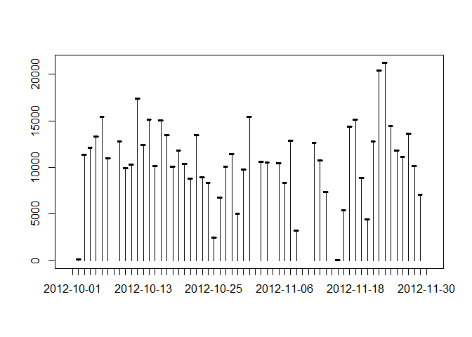
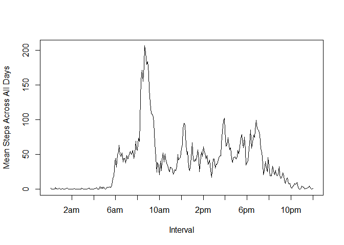
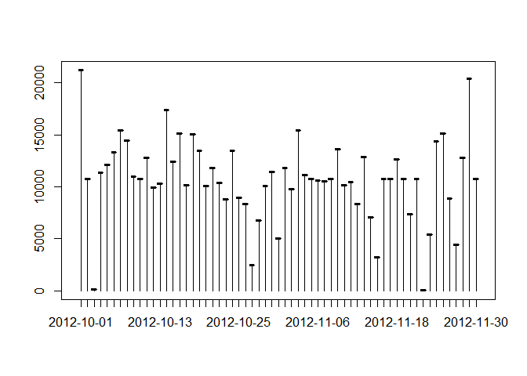
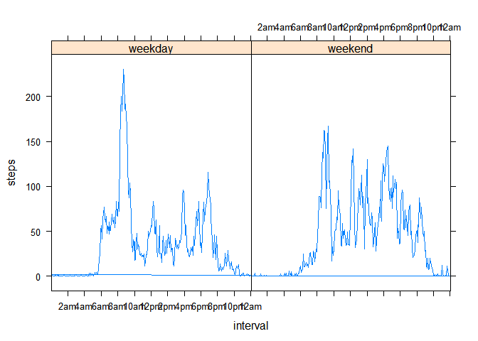

Load libraries:

    library("ggplot2", lib.loc="C:/Users/aeand/R/R-3.2.2/library")
    library("dplyr", lib.loc="C:/Users/aeand/R/R-3.2.2/library")

    ## 
    ## Attaching package: 'dplyr'
    ## 
    ## The following objects are masked from 'package:stats':
    ## 
    ##     filter, lag
    ## 
    ## The following objects are masked from 'package:base':
    ## 
    ##     intersect, setdiff, setequal, union

    library("lattice", lib.loc="C:/Users/aeand/R/R-3.2.2/library")

Download dataset:

    fileUrl <- "https://d396qusza40orc.cloudfront.net/repdata%2Fdata%2Factivity.zip"
    download.file(fileUrl,destfile="repdata_data_activity.zip")
    unzip(zipfile="repdata_data_activity.zip")

Load data:

    repdata <- read.csv("activity.csv")

Create data frame of the total number of steps taken each day:

-   Manipulate date and interval elements
-   Sum the intervals for each day
-   Create and label data frame with dates and steps

<!-- -->

    repdata$date <- as.Date(as.character(repdata$date))
    repdata$interval <- as.factor(repdata$interval)
    daysteps <- tapply(repdata$steps, factor(repdata$date), sum)
    x <- as.factor(unique(repdata$date))
    daysum <- data.frame(x, daysteps)
    names(daysum) <- c("Date", "Total Steps")

Create histogram of total steps taken each day:

    plot(daysum$Date, daysum$`Total Steps`)
    lines(daysum$Date, daysum$`Total Steps`, type = "h")

Calcluate mean and median of total steps take each day:

    meansteps <- mean(daysteps, na.rm = T)
    medsteps <- median(daysteps, na.rm = T)
    meansteps

    ## [1] 10766.19

    medsteps

    ## [1] 10765

Calculate the mean steps taken for each interval accross all days:

-   Calculate means
-   Create data frame

<!-- -->

    meanalldays <- data.frame(tapply(repdata$steps, factor(repdata$interval), mean, 
                                    na.rm = T))
    names(meanalldays) <- c("Mean.All.Days")

Create time series plot for mean steps taken by interval:

    labels <- c("2am", "4am", "6am", "8am", "10am", "12pm", "2pm", "4pm", "6pm", "8pm", 
                "10pm", "12am")
    at <- seq(24, 288, by = 24)
    plot(meanalldays, xlab = "Interval", ylab = "Mean Steps Across All Days", xrange 
         = meanalldays$Interval, type = "l", xaxt = "n")
    axis(side = 1, at = at, labels = labels)

Find and print the interval and value of the interval with the most mean
steps taken

    max <- max(meanalldays)
    meanalldays[meanalldays$Mean.All.Days == max,]

    ##      835 
    ## 206.1698

Impute missing values in dataset (all missing values are in 'steps'
column):

-   Sum missing values
-   Subset original data rows with missing values
-   Create data frame of mean steps taken for each interval
-   Replace missing values with the mean steps taken in corresponding
    interval
-   Combine data frames into new data set with missing values imputed

<!-- -->

    sum(is.na(repdata))

    ## [1] 2304

    nasub <- subset(repdata, is.na(repdata$steps))
    nonnasub <- subset(repdata, !is.na(repdata$steps))
    intermeans <- meanalldays
    intermeans$interval <- levels(repdata$interval)
    nasub$steps[nasub$interval == intermeans$interval] <- intermeans$Mean.All.Days
    repdata.i <- rbind(nonnasub, nasub)

Recalculate total steps taken for each day using imputed data set:

-   Sum the intervals for each day
-   Create and label data frame with dates and steps

<!-- -->

    daysteps.i <- tapply(repdata.i$steps, factor(repdata.i$date), sum)
    x.i <- as.factor(unique(repdata.i$date))
    daysum.i <- data.frame(x.i, daysteps.i)
    names(daysum.i) <- c("Date", "Total Steps")

Create histogram of total steps taken each day, with missing values
imputed:

    plot(daysum.i$Date, daysum.i$`Total Steps`)
    lines(daysum.i$Date, daysum.i$`Total Steps`, type = "h")

Calcluate mean and median of total steps take each day, with missing
values imputed:

    meansteps.i <- mean(daysteps.i)
    medsteps.i <- median(daysteps.i)
    meansteps.i

    ## [1] 10766.19

    medsteps.i

    ## [1] 10766.19

Compare difference in means and medians for original and imputed
datasets:

-   Print the values for the imputed data set minus the values for the
    origianl dataset

<!-- -->

    meansteps.i - meansteps

    ## [1] 0

    medsteps.i - medsteps

    ## [1] 1.188679

Create separate data frames for weekday and weekend observations,using
dataset with imputed values:

-   Label observations by day of the week
-   Split into data frame for weekdays and data frame for weekend days
-   Create day type variable for weekdays and weekend days

<!-- -->

    repdata.i$wkdays <- weekdays(repdata.i$date, abbreviate = T)
    d <- c("Mon", "Tue", "Wed", "Thu", "Fri")
    wkdaydf <- subset(repdata.i, repdata.i$wkdays %in% d)
    wkenddf <- subset(repdata.i, !repdata.i$wkdays %in% d)
    wkdaydf$daytype <- "weekday"
    wkenddf$daytype <- "weekend"

Calculate the mean steps taken for each interval across days for day
type (weekday and weekend):

-   Calculate means steps for intervals across weekday day type
-   Create data frame with means steps for each interval

<!-- -->

    meanwkdays <- data.frame(tapply(wkdaydf$steps, factor(wkdaydf$interval), mean))
    names(meanwkdays) <- "Mean.Wk.Days"
    meanwkdays$interval <- levels(repdata$interval)
    wkdaydf$steps[wkdaydf$interval == meanwkdays$interval] <- meanwkdays$Mean.Wk.Days

-   Calculate means for wintervals across weekend day type
-   Create data frame with means steps for each interval

<!-- -->

    meanwkenddays <- data.frame(tapply(wkenddf$steps, factor(wkenddf$interval), mean))
    names(meanwkenddays) <- "Mean.Wk.Days"
    meanwkenddays$interval <- levels(repdata$interval)
    wkenddf$steps[wkenddf$interval == meanwkenddays$interval] <- meanwkenddays$Mean.Wk.Days

-   Combine weekday and weekend data frames into new data set
-   Convert day type labels to factors

<!-- -->

    repdata.i2 <- rbind(wkdaydf, wkenddf)
    repdata.i2$daytype <- as.factor(repdata.i2$daytype)

Create panel of time series plots for mean steps taken by interval for
each day type:

    xyplot(steps ~ interval | daytype, data = repdata.i2, type = "l", 
           scales = list(x=list(at = at, labels = labels)))

